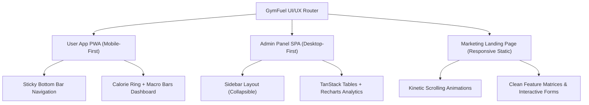

# 🎨 GymFuel — UI/UX Design System

This document outlines the visual system, style guide, and interface specifications for the three GymFuel frontends, combining **modern 2026 fitness app trends** (dark-default modes, high-energy neon accents, functional micro-motions) with our core product requirements.

---

## 📸 Design Inspiration & Visual References

We align the GymFuel interface directly with the following reference UI designs saved under the [docs/](file:///c:/AI-augmented/gym_project/docs) directory:

1. **PWA Mobile UI Inspiration** (see [ui_ref_1.jpg](file:///c:/AI-augmented/gym_project/docs/ui_ref_1.jpg)):
   - Displays modern, high-contrast dark mobile layouts with neon accents. Includes specific designs for activity calendar grids, progress area-charts, workout details card overlays, and profile stats lists.
2. **Desktop Web App Dashboard Layout** (see [ui_ref_2.png](file:///c:/AI-augmented/gym_project/docs/ui_ref_2.png)):
   - Features a prominent centered circular progress ring indicating active calories, macro metrics sliders (Carbs, Protein, Fat), activity line graphs, and hydration log cards.

These visual guides establish the exact layout paradigms, density, and glow effects for all user pages.

---

## 1. Visual Identity & Color Token System

We use a premium, modern high-energy dark-mode theme to reduce eye strain, convey performance/tech-forward vibes, and spotlight metric visualizers.

### Primary Color Palettes (Tailored HSL)

| Token                 | HSL / Hex                         | Visual           | Purpose                                           |
| :-------------------- | :-------------------------------- | :--------------- | :------------------------------------------------ |
| `--bg-base`           | `hsl(240, 10%, 4%)` / `#09090b`   | Dark base        | Deepest black for application canvas background   |
| `--bg-surface`        | `hsl(240, 6%, 10%)` / `#16161a`   | Card surface     | Glassmorphic/elevated container background        |
| `--border-color`      | `hsl(240, 5%, 20%)` / `#2f2f35`   | Card borders     | Subtle high-quality boundaries                    |
| `--text-primary`      | `hsl(0, 0%, 98%)` / `#fafafa`     | Primary text     | Clean white, maximum readability                  |
| `--text-secondary`    | `hsl(240, 5%, 65%)` / `#a1a1aa`   | Muted text       | Meta labels, unit descriptions                    |
| `--accent-neon-green` | `hsl(150, 100%, 50%)` / `#00ff88` | Active energy    | Focus indicator, calories burned, completed items |
| `--accent-cyber-blue` | `hsl(190, 100%, 50%)` / `#00d4ff` | Hydration / Info | Water tracking, stats highlights, secondary CTAs  |
| `--accent-coral`      | `hsl(12, 100%, 55%)` / `#ff5533`  | Warning / High   | Banned status, error logs, calories exceeded      |

---

## 2. Typography & Hierarchy

To ensure instant readability during movement, we use clean geometric variable fonts paired with expressive, high-impact heading typefaces.

- **Primary Copy (UI & Dashboard):** `Inter` or `Outfit` (Sans-serif)
- **Oversized Numbers (Stats):** `Space Grotesk` or `Syne` (Bold, geometric)
- **Brand Headings (Landing Page):** `Clash Display` or `Cabinet Grotesk` (Kinetic, high-contrast)

### Text Classes

- `font-stat`: Large numeric values, e.g., `42px` / `line-height: 1.0` / `font-weight: 700`
- `font-heading`: Standard page headers, e.g., `24px` / `font-weight: 600` / `letter-spacing: -0.02em`
- `font-body`: Body description copy, e.g., `14px` / `line-height: 1.6` / `color: var(--text-secondary)`

---

## 3. App-Specific Layouts & Page Specs



---

### 3.1 — User App (React PWA)

Optimized for mobile-first views with **zero-click navigation** shortcuts for tracking food and workouts.

#### Layout Structure

- **Top Bar**: App logo on left, current streak counter widget on right.
- **Sticky Bottom Navigation Bar**:
  - `Dashboard` (Home Icon)
  - `Meals` (Log Icon)
  - `Scanner` (Camera/Scan Floating Action Button - FAB)
  - `Workout` (Dumbbell Icon)
  - `Coach` (Gemini Chat Icon)
- **Main Container**: Flex layout with a max-width of `480px` centered on desktop viewports.

#### Core Page Mockups (Styling Concept)

##### `/dashboard` (The Central Metric Hub)

- A custom CSS radial svg progress ring representing **Calories Eaten / Target Calories** in the center. Accented with `--accent-neon-green`.
- Three horizontal progress indicators below representing Carb, Protein, and Fat intakes.
- Water logs represented by a set of interactive, wave-animated glasses. Clicking a glass increments consumption instantly.

##### `/scanner` (Frictionless AI Camera Overlay)

- A full-screen camera container utilizing native WebRTC video.
- A pulsing neon green border box displaying real-time scan boundaries.
- Single tap camera button capturing image data instantly to stream to Gemini AI for ingredient estimation.

##### `/coach` (Responsive Stream Chat)

- Clean messaging layout with chat bubbles aligned right (user) and left (AI Coach).
- AI Coach responses render with a smooth opacity fade-in to simulate streaming words.
- Input container features quick-action tags at the top (e.g. _"Log my breakfast"_ or _"Rate my form"_).

---

### 3.2 — Admin Panel (React SPA)

Designed for density, clarity, and quick moderation workflows.

#### Layout Structure

- **Sidebar Layout**:
  - `Dashboard` (Home)
  - `Users` (Moderation & List)
  - `Foods` (Approval queue)
  - `Workouts` (Templates scheduler)
  - `API Monitor` (Realtime logs)
  - `Analytics` (Recharts graphs)
- **Density**: Card metrics use flat colored borders (`1px solid var(--border-color)`) with minimal padding to display maximum data.

#### Core Page Mockups

##### `/` (Admin Dashboard)

- Top row: 4 key performance cards: _Total Users_, _Active Scans_, _API Quota Usage_, _Active Errors_.
- Mid section: Live Socket.io-driven area chart showing API request load over the last hour.
- Lower section: Live audit stream scrolling new admin actions.

##### `/users` (Moderation Table)

- A paginated datatable featuring search filtering by role, status (Active/Banned), or registration date.
- Hovering over a row highlights the user and exposes a quick action button (e.g. _Ban User_ in `--accent-coral` red).

---

### 3.3 — Public Marketing Landing Page

Designed to captivate new visitors with premium aesthetic presentations.

#### Sections

1.  **Hero Section**:
    - Large kinetic title: _"Fuel Your Gym Goals with Precision AI"_
    - Floating animated glassmorphic screenshot mockup of the PWA dashboard.
2.  **Features Grid**:
    - Interactive cards utilizing hover scaling: barcode scanning, AI coaching, custom workout builders.
3.  **How It Works**:
    - A clean 3-step vertical sequence connecting onboarding parameters directly to dashboard outputs.

---

## 4. Animation & Micro-Interactions Guide (Framer Motion)

Animations are essential in 2026 fitness apps to give users satisfying "dopamine hits" upon logging tasks.

- **Set Completion Checklist:** Checking off a workout set causes a slight scale pop (`scale: [1, 1.15, 1]`) and changes colors from `--text-secondary` to `--accent-neon-green`.
- **Page Transitions:** Standard slide-up animation when switching routes to give the web app a native mobile-app feel:
  ```javascript
  const pageTransition = {
    initial: { opacity: 0, y: 15 },
    animate: { opacity: 1, y: 0 },
    exit: { opacity: 0, y: -15 },
  };
  ```
- **Chat Bubble Entry:** AI chat bubbles slide in from the bottom-left with a spring effect (`type: "spring", stiffness: 300, damping: 25`).
